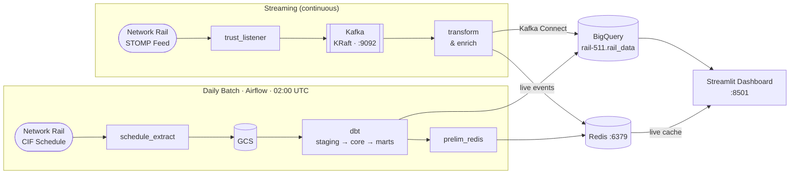

# Rail3 — UK National Rail Real-Time Analytics

A production-grade streaming analytics platform that ingests Network Rail's live train movement feed, stores it in BigQuery, transforms it with dbt, and surfaces it in a Streamlit dashboard with a Redis live-cache layer.

---

## Architecture



---

## Directory Layout

```
Rail3/
├── dags/                        # Airflow DAG definitions
│   └── rail_daily_pipeline.py   # Daily batch: extract → dbt → Redis warm-up
├── dashboard/                   # Streamlit app
│   ├── main.py
│   └── utils/
│       ├── bq_helpers.py        # BigQuery query functions
│       ├── redis_helpers.py     # Redis read helpers
│       ├── map_helpers.py       # Pydeck layer builders
│       └── utils.py
├── dbt/                         # dbt project (rail_data_project)
│   ├── models/
│   │   ├── staging/             # Raw → typed views
│   │   ├── intermediate/        # Join & enrich
│   │   ├── core/                # Dims & facts (tables)
│   │   └── marts/               # Dashboard-ready outputs
│   ├── macros/                  # SQL helper macros
│   ├── seeds/                   # Reference CSVs (STANOX, stops, TOC…)
│   └── profiles.yml             # BigQuery connection (uses env vars)
├── extraction/                  # Streaming ingestion
│   ├── trust_listener.py        # STOMP consumer → Kafka producer
│   ├── trust_transform.py       # Kafka consumer → typed topics
│   └── trust/                   # Message-type parsers
│       ├── activation.py
│       ├── cancellation.py
│       ├── movement.py
│       └── …
├── kafka/                       # Kafka utilities
│   ├── kafka_producer.py
│   ├── kafka_consumer.py
│   ├── deploy_connectors.py     # Registers Kafka Connect sink configs
│   └── sink_config/             # WePay BigQuery sink JSON configs
├── pipelines/
│   ├── trust_enrich.py          # Enrichment consumer (Redis lookup)
│   ├── live_redis.py            # Live cache writer
│   └── batch/
│       ├── dim_refresh_daily.py # dbtRunner wrapper
│       └── live_refresh.py      # Kicks off Redis warm-up
├── redis/
│   └── prelim_redis.py          # Bulk Redis warm-up from BigQuery dims
├── connect-plugins/             # WePay BigQuery Sink connector JARs
├── .env.example                 # Required environment variables (template)
├── .gitignore
├── docker-compose.yml           # Full stack: Kafka, Connect, Redis, Airflow
├── Dockerfile                   # Streaming services image
├── Dockerfile.airflow           # Airflow image
└── requirements.txt
```

---

## Prerequisites

| Requirement | Version |
|---|---|
| Python | 3.12 |
| Docker + Docker Compose | Latest stable |
| GCP project with BigQuery & GCS enabled | — |
| GCP service account JSON key | — |
| Network Rail Open Data account | Free registration at [datafeeds.networkrail.co.uk](https://datafeeds.networkrail.co.uk) |

---

## Quick Start

### 1. Clone and configure environment

```bash
git clone https://github.com/kaarkaar72/rail3.git
cd rail3
cp .env.example .env
```

Edit `.env` with your credentials (see [Environment Variables](#environment-variables)).

Place your GCP service account key at `./service-account.json` (never commit this file).

### 2. Start infrastructure

```bash
docker compose up -d broker connect redis postgres
```

Wait for all services to be healthy:

```bash
docker compose ps
```

### 3. Deploy Kafka Connect BigQuery sink connectors

```bash
python kafka/deploy_connectors.py
```

### 4. Start the streaming pipeline

```bash
docker compose up -d trust-listener trust-transform trust-enrich live-redis-updater
```

### 5. Run the daily batch (first time / manual)

```bash
# Extract today's CIF schedule → BigQuery
python extraction/schedule_extract_daily.py

# Run all dbt models
python pipelines/batch/dim_refresh_daily.py

# Warm Redis caches
python pipelines/batch/live_refresh.py
```

Or use Airflow (starts automatically via Docker):

- Airflow UI: [http://localhost:8080](http://localhost:8080) — default credentials in `.env`

### 6. Launch the dashboard

```bash
# From the project root
streamlit run dashboard/main.py
```

Open [http://localhost:8501](http://localhost:8501).

---

## Environment Variables

Copy `.env.example` to `.env` and fill in each value. **Never commit `.env` or `service-account.json`.**

| Variable | Description | Example |
|---|---|---|
| `STOMP_HOST` | Network Rail STOMP host | `publicdatafeeds.networkrail.co.uk` |
| `STOMP_PORT` | STOMP port | `61618` |
| `STOMP_USER` | Your Network Rail email | `you@example.com` |
| `STOMP_PASS` | Your Network Rail password | — |
| `STOMP_QUEUE` | STOMP topic to subscribe | `/topic/TRAIN_MVT_ALL_TOC` |
| `TRAIN_MOVEMENTS_TOPIC` | Kafka topic for raw messages | `rail_movement_raw` |
| `KAFKA_BOOTSTRAP_SERVERS` | Kafka address | `localhost:9092` |
| `RECONNECT_DELAY_SECS` | STOMP reconnect backoff (seconds) | `5` |
| `HEARTBEAT_INTERVAL_MS` | STOMP heartbeat interval (ms) | `15000` |
| `REDIS_HOST` | Redis hostname | `localhost` |
| `REDIS_PORT` | Redis port | `6379` |
| `BQ_PROJECT_ID` | GCP project ID | `rail-511` |
| `BQ_DATASET` | BigQuery dataset | `rail_data` |
| `BQ_TABLE` | BigQuery raw schedule table | `rail_schedule_raw` |
| `GCS_BUCKET` | GCS bucket for CIF Parquet uploads | `rail_storage` |
| `GCP_SA_KEYFILE` | Path to service account JSON | `./service-account.json` |
| `DBT_KEYFILE_PATH` | Path to service account JSON (dbt) | `./service-account.json` |
| `KAFKA_CONNECT_URL` | Kafka Connect REST endpoint | `http://localhost:8083/connectors` |
| `AIRFLOW__CORE__FERNET_KEY` | Airflow encryption key | (generate — see `.env.example`) |
| `AIRFLOW_ADMIN_USER` | Airflow admin username | `admin` |
| `AIRFLOW_ADMIN_PASSWORD` | Airflow admin password | — |

---

## dbt Models

| Layer | Materialisation | Purpose |
|---|---|---|
| `staging/` | View | Light transforms on raw BigQuery tables |
| `intermediate/` | View | Joins and enrichment across staging models |
| `core/` | Table | Dims and facts (train schedule, movements, locations, TOC…) |
| `marts/` | Table/View | Dashboard-ready outputs: `live_train`, `train_status`, `train_delay`, `route_start_stop` |

Run the full model lineage:

```bash
cd dbt
dbt run
dbt test
dbt docs generate && dbt docs serve  # opens browser
```

---

## Batch Pipeline (Airflow DAG)

The `rail_daily_pipeline` DAG runs every day at **02:00 UTC**:

```
schedule_extract  →  dbt_run  →  redis_refresh
```

1. **schedule_extract** — Downloads the CIF schedule from Network Rail, converts to Parquet, uploads to GCS, loads into BigQuery.
2. **dbt_run** — Runs all dbt models via `dbtRunner` (staging → intermediate → core → marts).
3. **redis_refresh** — Warms `dim_geo` and `dim_train_schedule` into Redis for the enrichment pipeline and dashboard.

---

## Kafka Topics

| Topic | Producer | Consumer |
|---|---|---|
| `rail_movement_raw` | `trust_listener.py` | `trust_transform.py` |
| `rail_activation`, `rail_cancellation`, `rail_movement`, … | `trust_transform.py` | Kafka Connect (→ BigQuery), `trust_enrich.py` |
| `rail_movement_enriched` | `trust_enrich.py` | `live_redis.py` |
| `rail_movement_dlq` | `trust_transform.py` | (monitoring) |

---

## Security

- `.env` and `service-account.json` are listed in `.gitignore` and must **never** be committed.
- Use `.env.example` as the only committed reference for environment configuration.
- Rotate your GCP service account key and Network Rail STOMP password before pushing to a public repository.
- If credentials were previously committed, [purge them from git history](https://docs.github.com/en/authentication/keeping-your-account-and-data-secure/removing-sensitive-data-from-a-repository) before making the repo public.

---

## Tech Stack

| Component | Technology |
|---|---|
| Real-time feed | Network Rail STOMP (STOMP 1.2) |
| Message broker | Apache Kafka 3.7.0 (KRaft, no ZooKeeper) |
| Stream ingestion | Kafka Connect + WePay BigQuery Sink 2.5.7 |
| Data warehouse | Google BigQuery (`rail-511.rail_data`) |
| Object storage | Google Cloud Storage |
| Transformation | dbt-bigquery 1.8.2 |
| Live cache | Redis 7.2 |
| Orchestration | Apache Airflow 2.x (LocalExecutor) |
| Dashboard | Streamlit 1.40, Pydeck, Altair |
| Containerisation | Docker Compose |
| Language | Python 3.12 |

---

## License

Personal project. Not affiliated with Network Rail or any Train Operating Company.
